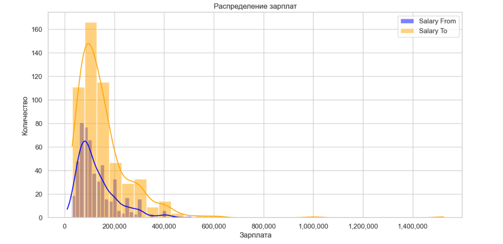

# Анализ вакансий и трендов на рынке труда

Этот проект предназначен для анализа данных с платформы HH.ru (HeadHunter). В ходе работы был выполнен сбор, очистка и анализ данных вакансий, размещенных на сайте.

---

## Практическая ценность проекта для бизнеса

Проект по сбору данных с API HH.ru представляет собой стратегически важный инструмент для бизнеса, который улучшает понимание рыночной ситуации, оптимизирует процессы найма и помогает в разработке эффективных кадровых стратегий.

### 1. Оценка рыночной ситуации и трендов
- **Анализ рыночных тенденций**: Определение востребованных профессий, навыков и уровней зарплат.
- **Оценка конкурентоспособности**: Сравнение предложений компании с вакансиями конкурентов.

### 2. Оптимизация процесса найма
- **Оптимизация ресурсов**: Выявление востребованных ролей и фокусировка на ключевых позициях.
- **Повышение эффективности**: Снижение времени поиска кандидатов и оптимизация рекламы вакансий.

### 3. Прогнозирование зарплат и затрат на персонал
- **Прогноз зарплатных ожиданий**: Подготовка к изменениям на рынке.
- **Оптимизация затрат**: Расчет бюджета для привлечения сотрудников с учетом рыночных данных.

### 4. Анализ востребованных навыков
- **Оценка потребности в обучении**: Выявление актуальных навыков для подготовки сотрудников.
- **Прогнозирование трендов**: Подготовка к будущим изменениям на рынке.

---

## Процесс сбора данных

Процесс включает сбор информации о вакансиях через API HH.ru с учетом следующих шагов:

1. **Настройка логирования**: Используется библиотека `loguru`, логи хранятся в файле `etl_process.log` с ротацией каждые 7 дней.
2. **Функция `fetch_vacancies()`**:
   - Запрос данных через API с обработкой результатов.
   - Логирование прогресса каждые 5 страниц.
3. **Обработка ошибок и пауз**: Учтены сетевые ошибки и ограничения API (задержка 1 секунда между запросами).
4. **Финальный результат**: Все вакансии сохраняются в список для дальнейшей обработки.

---

## Предобработка данных

Для анализа данных выполняются следующие шаги:

1. **Очистка данных**:
   - Удаление пустых значений в ключевых столбцах.
   - Преобразование зарплат в рубли с использованием курса валют.
   - Очистка текстов от HTML-тегов.
2. **Преобразование зарплат**: Использование курсов ЦБ РФ для конвертации в единую валюту.
3. **Сохранение данных**: Обновленные данные сохраняются в базу данных SQLite.

---

# EDA
В ходе анализа данных о вакансиях были выявлены следующие ключевые аспекты:

## Основные выводы о распределении зарплат

1. **Распределение зарплат**:
   - Гистограмма показывает **асимметрию распределения зарплат**, где большинство значений находятся в диапазоне от 75,000 до 350,000 рублей.
   - **Пики распределения**:
     - Медианные значения "Salary From" сосредоточены около 150,000 рублей.
     - Верхняя граница зарплат ("Salary To") имеет больший разброс, достигая до 1,000,000 рублей и выше.
   - Зарплаты выше 400,000 рублей встречаются редко, что указывает на нишевые вакансии с высокими требованиями.

2. **Особенности распределения**:
   - Нижние границы зарплат ("Salary From") сгруппированы ближе к реальным значениям минимальных предложений, в то время как верхние границы ("Salary To") варьируются с большим диапазоном.
   - Форма графика указывает на логнормальное распределение, характерное для данных о зарплатах.

---

## Структура данных

### 1. Размер данных:
- Общее количество записей: **534**.
- В датасете отсутствуют пропущенные значения, что делает его готовым для дальнейшего анализа.

### 2. Основные столбцы:
- **salary_from** и **salary_to**: Диапазоны зарплат в рублях.
- **area_name**: Географическое расположение вакансий.
- **snippet_requirement** и **snippet_responsibility**: Описание требований и обязанностей.
- **professional_roles**: Категории профессиональных ролей.

### 3. Примеры данных:
- Вакансии охватывают широкий спектр областей, включая **BI-аналитику**, **инженеров данных**, а также **разработчиков решений**.
- Большинство вакансий опубликовано в крупных городах, таких как **Москва** и **Новосибирск**.

### 4. Пропуски данных:
- **Пропуски отсутствуют**, что делает возможным выполнение дальнейшего анализа без дополнительной очистки.

---

## Графики и визуализация

---

## Метрики качества данных

| Метрика                                          | Значение (%)    |
|--------------------------------------------------|-----------------|
| Консистентность данных                           | 100             |
| Актуальность данных (среднее количество дней)    | 2.27            |
| Уникальность данных                              | 100             |
| Качество текстовых данных (средняя длина текста) | 148.34          |

**Выводы:**
- Данные полны, логически согласованы и актуальны.
- Средняя длина текстов позволяет использовать их для анализа требований и обязанностей.

---

## Автоматизация процесса

### Этапы:
1. **Инициализация базы данных**: Создание таблицы `vacancies` с полями для хранения информации о вакансиях.
2. **Получение данных через API HH.ru**: Сбор вакансий по ключевым параметрам.
3. **Сохранение данных**: Использование метода `INSERT OR IGNORE` для предотвращения дублирования.
4. **Обработка данных**: Очистка, преобразование и подготовка данных к анализу.

---

## Дашборд: Визуализация данных

### Основные компоненты:
1. **Метрики**:
   - Общее количество вакансий.
   - Средняя зарплата.
   - Количество уникальных регионов.
2. **Фильтры**:
   - Выбор регионов.
   - Фильтрация по уровню опыта.
3. **Графики**:
   - **Средняя зарплата по регионам**: Топ-10 регионов.
   - **Популярные роли с зарплатой**: Топ-10 ролей.
   - **Зависимость зарплаты от опыта**: Интерактивные столбчатые графики.

---

## Реализация дашборда

